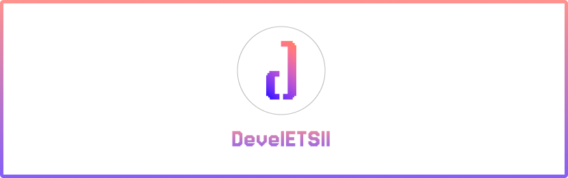

Somos una asociación tecnológica y creativa de la **Escuela Técnica Superior de Ingeniería Informática de la Universidad de Sevilla**. Un espacio donde estudiantes pueden aprender, colaborar y convertir ideas en proyectos reales.

---

## 🚀 Sobre DevelETSII

DevelETSII nace con una idea sencilla: **llevar el aprendizaje más allá de las aulas**.

Creamos un entorno donde estudiantes de diferentes perfiles pueden encontrarse, compartir conocimientos y trabajar juntos en proyectos tecnológicos y creativos.

Aquí no importa si estás empezando o ya tienes experiencia. Puedes **aprender, enseñar, experimentar, construir y equivocarte** junto a otras personas con las mismas inquietudes.

### 💡 Nuestra misión

Fomentar una comunidad universitaria activa alrededor de la tecnología, la creatividad y la innovación, impulsando proyectos colaborativos y proporcionando oportunidades para desarrollar tanto habilidades técnicas como personales.

### 🌐 Qué nos mueve

* **Aprender haciendo** — Convertimos conocimientos en proyectos reales.
* **Colaborar** — Trabajamos en equipos y compartimos lo que sabemos.
* **Experimentar** — Damos espacio a ideas y tecnologías nuevas.
* **Crear** — Transformamos ideas en productos, herramientas y experiencias.
* **Conectar** — Acercamos estudiantes, profesionales y comunidad universitaria.
* **Compartir** — Apostamos por el conocimiento abierto y el software libre.

## 🔥 Proyectos destacados

Construyendo ideas que van más allá del aula.

En DevelETSII trabajamos en proyectos donde ponemos en práctica nuestros conocimientos, experimentamos con nuevas tecnologías y aprendemos unos de otros.

<!-- PROJECTS:START -->

<!-- PROJECTS:END -->

---

## 📊 Métricas

    

  
  
  
  
  

---

## ✨ Actividades

> **Aprender, crear y compartir más allá de las aulas.**

En DevelETSII organizamos actividades para aprender nuevas tecnologías, poner conocimientos en práctica y conectar con otros estudiantes y profesionales.

#### 💻 Talleres y cursos
Sesiones prácticas sobre desarrollo web, aplicaciones móviles, diseño de interfaces, herramientas y otras tecnologías.

#### 🎤 Charlas y conferencias
Profesionales, docentes y antiguos alumnos comparten experiencias, conocimientos y una visión del mundo tecnológico.

#### 🤝 Proyectos colaborativos
Equipos multidisciplinares que trabajan juntos para convertir ideas en aplicaciones, herramientas y productos reales.

#### 🧑‍🤝‍🧑 Mentoring
Espacios donde estudiantes pueden aprender de otros miembros, compartir experiencia y acompañarse durante su aprendizaje.

#### 🌍 Eventos y competiciones
Participación en congresos, ferias, competiciones y otras iniciativas fuera de la universidad.

---

## ❤️ Por qué unirse

> **No solo aprendas tecnología. Aprende a construir con ella.**

Formar parte de DevelETSII te permite complementar tu formación universitaria con experiencias que difícilmente encontrarás únicamente en clase.

- **🌟 Aprende haciendo**: 
Experimenta con tecnologías, herramientas y metodologías mientras trabajas en proyectos reales.

- **🚀 Construye tu portfolio**: 
Crea proyectos que puedas enseñar, compartir y utilizar para demostrar tus capacidades

- **👥 Conoce a otros estudiantes**
Encuentra personas con intereses similares y trabaja junto a estudiantes de diferentes cursos y perfiles.

- **🧠 Desarrolla habilidades**
Mejora no solo tus conocimientos técnicos, sino también tu comunicación, liderazgo, organización y trabajo en equipo.

- **💡 Convierte ideas en proyectos**
No necesitas esperar a que exista una asignatura para desarrollar una idea. Propón, encuentra un equipo y constrúyela.

- **💼 Acércate al mundo profesional**
Conoce profesionales, antiguos alumnos y empresas, y descubre nuevas oportunidades más allá de la universidad.

---

## 🚀 Únete a DevelETSII + contacto

> **Una idea. Un equipo. Un proyecto. Empieza aquí.**

¿Quieres aprender, crear algo nuevo o simplemente conocer a gente con tus mismas inquietudes?

**Únete a la comunidad, descubre nuestros proyectos y encuentra tu sitio en DevelETSII.**

### 💬 Comunidad

Únete a nuestro **Discord**, **WhatsApp** y **Instagram** para conocer a otros miembros, participar en conversaciones y enterarte de las próximas actividades.

### ✉️ Contacto

¿Tienes una propuesta, quieres colaborar o quieres saber más sobre la asociación? Escríbenos a través de nuestros canales oficiales.

